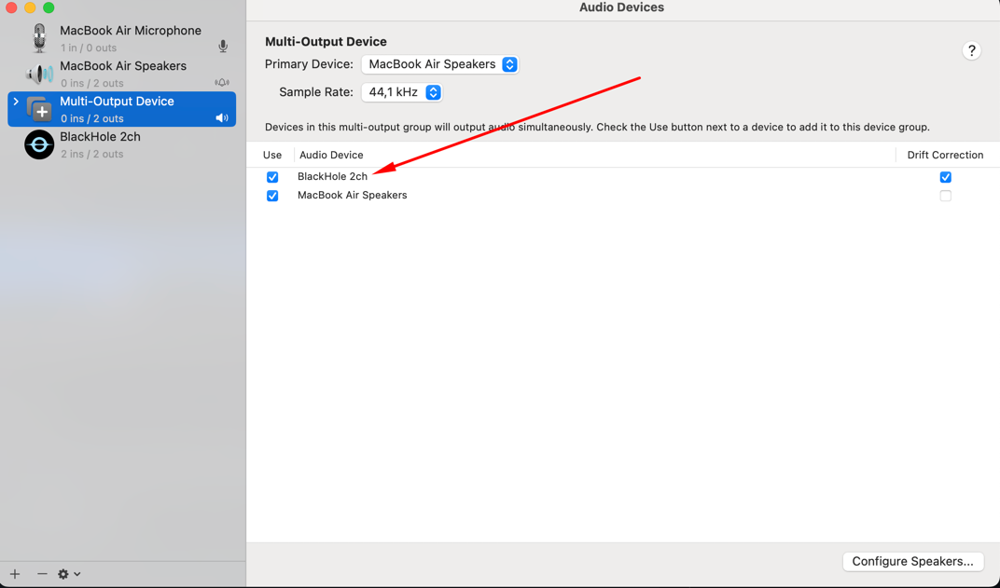
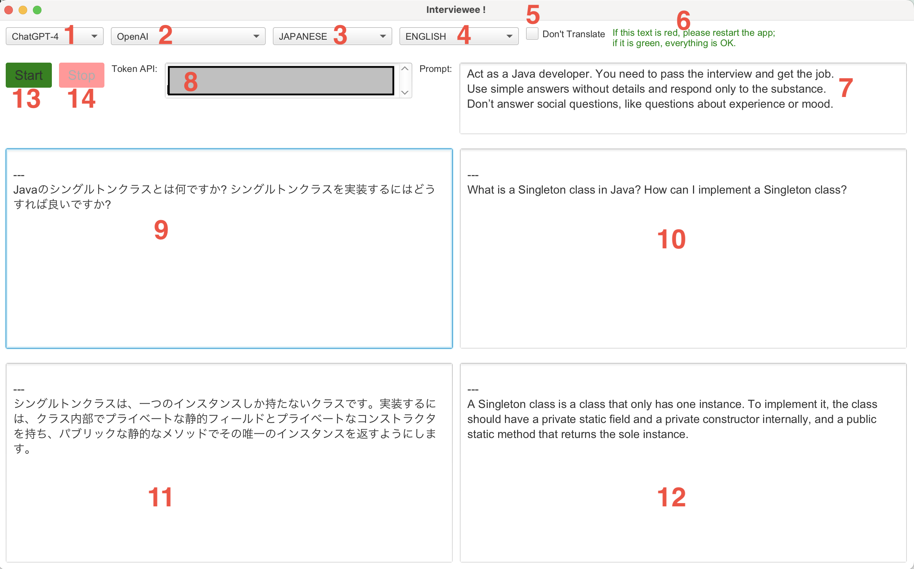

# Interviewee

Currently only macOS is supported

## About the Application

**Interviewee** is a Java application that uses AI's API to provide audio transcribes, answers
to interview questions and translating questions and answers to another language. The application captures audio during
interviews, transcribes the conversations, and displays subtitles in real time, using AI's API for Speech-to-Text and
Translation services.

## Important Notice

**Important!**
Our application does not encourage cheating in interviews or any fraudulent activities.
We simply aim to help people be more confident in interviews and avoid silly mistakes.

Sometimes, interviews are conducted by people who are completely incompetent in what they are asking and often read
questions from a list that have nothing to do with your field of expertise.
Yet you still need to answer these questions to pass the interview, and this is where **Interviewee** can help you.

Additionally, sometimes you may be interviewed by a foreign company.
Even if you're fluent in the foreign language, nerves can cause confusion or make you forget something crucial.
**Interviewee** is here to help you with that.

## Demo   

https://github.com/Alex777x/interviewee/assets/47153374/dcc442bf-3e4c-48a2-9935-51594c9f6d0b

### Key Features:

- Real-time answering of interview questions.
- Real-time transcription of interview questions and answers.
- Real-time translating questions and answers in real time.
- Integration with OpenAI's ChatGPT API for transcribing and translating audio.
- Support for multiple languages via OpenAI API translation.
- JavaFX-based GUI for displaying live transcriptions.

## Getting Started

### Prerequisites

- [Java 21](https://www.oracle.com/pl/java/technologies/downloads/)
- [OpenAI API Key](https://platform.openai.com/)
- [Apache Maven](https://maven.apache.org/download.cgi)

### macOS

First, you need to install [Homebrew](https://brew.sh/), a package manager for macOS. You can install it by running the
following command in the Terminal:

```shell
/bin/bash -c "$(curl -fsSL https://raw.githubusercontent.com/Homebrew/install/HEAD/install.sh)"
```

#### Dependencies and tools:

```text
XCode Command Line Tools    
BlackHole
```

Install XCode Command Line Tools by running the following command in the Terminal:

```shell
xcode-select --install
```

Install BlackHole, a virtual audio driver that allows you to route audio between applications. You can install it by
running the following command in the Terminal:

```shell
brew install blackhole-2ch
```

#### BlackHole configuration

Setup "Multi-Output Device" and set it as a default sound output device for your macOS.
Guidelines are available [HERE](https://github.com/ExistentialAudio/BlackHole/wiki/Multi-Output-Device)     
Speakers audio on macOS will be recorded from the virtual "BlackHole 2ch" microphone. Your and BlackHole microphone
device names could be "BlackHole 2ch":


### Windows

Work in progress

### Linux

Work in progress

## Installation

Clone the repository:

```shell
git clone https://github.com/Alex777x/interviewee.git
```

Navigate to the Interviewee folder:

```shell
cd interviewee
``` 

Run Maven command:

```shell
mvn clean install
```

## Running Interviewee

```shell
mvn clean javafx:run
```

Upon initiation, Interviewee will begin transcribing speaker output in real-time, generating a suggested response based
on the conversation. Please note that it might take a few seconds for the system to warm up before the transcription
becomes real-time.

## Usage



1. Choose an AI model that will answer questions. Currently only ChatGPT is supported.
2. Choose a Speech-to-Text model. Currently only OpenAI API is supported.
3. Choose a language for your interview.
4. Choose a second language to translate the questions and answers.
   If three (main language) and four (second languages) matches,
   Interviewee will not translate the questions and answers into a second language
5. If this checkbox is selected, Interviewee will not translate questions and answers into a second language.
6. This is the text indicator. If the text is red, then something is wrong, and you need to restart the application if
   the text is green, then everything is fine.
7. Specify the prompt to be used for AI.
8. Specify your OpenAI API key.
9. Area to display the last ten questions.
10. Area to display the last ten questions in a second language.
11. Area to display the last ten questions.
12. Area to display the last ten questions in a second language.
13. Start the app and start listening to the audio going to the output device.
14. Stop the app and stop listening to the audio going to the output device.

## Limitations

Default Mic and Speaker: not applicable for macOS Interviewee is currently configured to listen only to the default
set in your system. It will not detect sound from other devices or systems. If you wish to use a
different mic or speaker, you will need to set it as your default device in your system settings.

## Known Issues and Future Improvements

1. ~~The first start of the application can take quite a long time as there is loading dependencies such as Kafka~~
2. Sometimes the application does not start the first time and needs to restart
3. ~~Kafka is a terrible choice for this application, and you need to get rid of it and use instead the built-in Java
   methods of asynchronous data processing~~

## License

This project is licensed under the MIT License — see
the [LICENSE](https://github.com/Alex777x/interviewee/blob/master/LICENSE) file for details.

## Contributing

Contributions are welcome! Feel free to open issues or submit pull requests to improve Interviewee.
